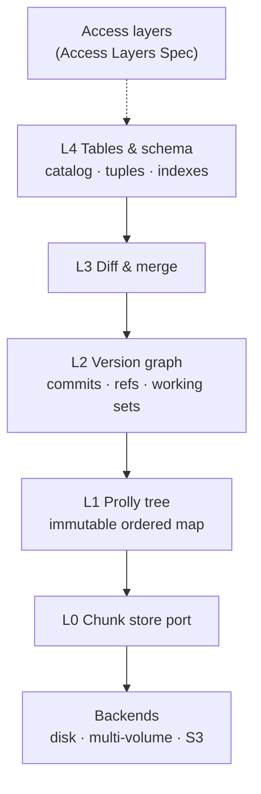

# Versioned DB — Engine Spec

Sep 22, 2026

## Overview

We are building a Git-for-data storage engine: every table is branchable, diffable, and mergeable. This spec covers the engine only (L0–L4) and the storage backends it runs on: local disk, one or more mounted partitions, and S3. SQL dialects and protocols (Postgres, MySQL, CLI, embedded API) live in the companion **Versioned DB — Access Layers Spec**.

> **Update Sep 22:** L0–L3 (backends, chunk store, prolly tree, version graph, diff and merge) are moving to the data-agnostic **Versioned DB — Storage Core Spec**, which reuses parts of disknexus-engine as a pinned, unmodified dependency. This doc will shrink to L4, the table model, as the Storage Core's table plugin (model id 3). Until that edit lands, where the two docs disagree, the Storage Core Spec wins.

**Goals**

- A storage core that gives cheap commits, branches, diffs, and three-way merges over ordered key-value data.
- A table layer on top of that core, usable without any SQL engine.
- Swappable storage backends behind one `ChunkStore` port: local disk, multiple mount points for scale-out, and S3.
- A stable L4 API that any access layer can build on without touching the engine.
- Every line of production code arrives behind a test that failed first.

**Non-goals for v1**

- SQL parsing, wire protocols, or dialect logic (see the Access Layers Spec).
- Distributed writes or multi-node consensus.
- Network file shares (SMB, NFS, FTP) as storage. Browsing snapshots over those protocols is an access layer, specced in the Access Layers Spec.

**Assumptions**

- Language: Go 1.23+ (memory-safe, strong Postgres wire libraries). Rust is the alternative; see Open questions.
- Data classification: treat all stored data as confidential by default.
- Auth model: access layers authenticate clients with vetted libraries and pass a Principal; the engine authorizes every call.
- Deployment: single-node server plus an embeddable library, running as a non-root user.

## Architecture and module boundaries

The engine is five layers, built bottom-up, with pluggable storage backends underneath. Each layer is its own Go module and depends only on the interfaces of the layer directly below it.



L0 to L4 are the **engine**. Backends plug in below L0; access layers plug in above L4. Either side can be swapped without touching the engine.

| Layer | Module path | Exposes (port) | May import |
| --- | --- | --- | --- |
| Backends | `core/chunk/<backend>` | `ChunkStore` implementations | L0 port + backend SDK |
| L0 | `core/chunk` | `ChunkStore` | stdlib only |
| L1 | `core/prolly` | `Map`, `Editor`, `DiffIter` | L0 |
| L2 | `core/vcs` | `Repo`, `Commit`, `RefStore`, `WorkingSet` | L0, L1 |
| L3 | `core/merge` | `Differ`, `Merger`, `ConflictSet` | L1, L2 |
| L4 | `core/table` | `Database`, `Table`, `Schema`, `Session` | L0–L3 |

**Boundary rules (enforced in CI)**

1. No upward imports. `depguard` in `golangci-lint` fails the build on any violation.
2. Interfaces are defined by the layer that owns the concept, in a `port.go` file, and are versioned.
3. Layers talk only through exported interfaces. No shared globals, no `init()` side effects.
4. Every port ships a **contract test suite** (`<pkg>/contract`). Every implementation must pass it. This is what makes modules swappable.
5. L4's `core/table` public API is the single entry point for anything above the core. An access layer that needs VCS operations gets them through `Session`, never by reaching into L2.

**Core public API sketch (L4)**

```go
type Database interface {
    Open(ctx context.Context, p Principal) (Session, error) // authz context required
}

type Session interface {
    Branch() string
    Checkout(ctx context.Context, branch string) error
    Begin(ctx context.Context) (Txn, error)
    Commit(ctx context.Context, msg string) (Hash, error)
    Merge(ctx context.Context, from string) (MergeResult, error)
    Diff(ctx context.Context, from, to Ref, table string) (RowDiffIter, error)
    Log(ctx context.Context, ref Ref, limit int) ([]CommitMeta, error)
    Close() error
}

type Txn interface {
    Table(name string) (Table, error)
    CreateTable(ctx context.Context, s Schema) error
    Commit(ctx context.Context) error // SQL transaction, not a VCS commit
    Rollback(ctx context.Context) error
}
```

Every method takes a `context.Context` for cancellation and deadlines. The `Principal` carried by the session is checked on every call, not only at open.

## Engineering process: fail-first TDD

No production code merges without a test that was observed failing first. CI proves it; reviewers do not take it on trust.

**The loop for every change**

1. **Red.** Write the smallest test that describes the next behavior. Run it and confirm it fails for the *right reason* (an assertion, not a compile error or panic in setup).
2. **Green.** Write the minimum code to pass. No extra branches, options, or "while I'm here" work.
3. **Refactor.** Remove duplication and clarify names with all tests green. Behavior does not change in this step.
4. **Commit in order.** The red test lands in its own commit (`test: ...`) before the implementation commit (`feat:` / `fix:`).

**How CI enforces fail-first**

- A `red-check` job checks out the PR's first `test:` commit, runs only the tests it added, and **requires them to fail**. If they pass against the old code, the PR is blocked: the test is not testing the change.
- The normal `test` job then runs the full suite on the PR head and requires everything to pass.
- Coverage gate: 90% branch coverage on `core/*`, 80% on adapters. Coverage may never drop on a PR.
- Build flags: `go vet`, `staticcheck`, and `golangci-lint` run with warnings as errors. All tests run with `-race`.

**Regression policy**

- Every bug gets a test named after its ticket (`TestRegression_ENG123_MergeDropsNullCell`) *before* the fix. The red-check job applies to fixes too.
- Regression tests live in `<pkg>/regress_test.go` and are never deleted. Changing one requires a reviewer from the owning layer.
- Any fuzz or property-test failure is minimized and checked in as a permanent seed or regression case.
- A nightly job runs the full suite, fuzzers for 30 minutes per target, and the Postgres compatibility suite.

**Test tiers**

| Tier | Tool | Where | Runs |
| --- | --- | --- | --- |
| Unit | `testing` + `testify/require` | every package | every push |
| Contract | shared suite per port | `<pkg>/contract` | every push, against every implementation |
| Property | `pgregory.net/rapid` | L1–L4 | every push (short), nightly (long) |
| Fuzz | native `go test -fuzz` | every decoder and parser boundary | nightly, 30 min per target |
| Determinism / golden | hash snapshots | L1, L2 | every push |
| Integration | real server on a temp dir | L5, L6 | every push |
| Compatibility | sqllogictest + `psql` + ORM smoke tests | L6 pgwire | nightly |
| Crash recovery | kill -9 harness | L0, L2 | nightly |

**Definition of done for any ticket:** red commit observed in CI, green suite, contract tests updated if a port changed, regression test added if it was a bug, and the security checklist for that layer ticked.

## L0: Chunk store

L0 stores immutable byte blobs ("chunks") keyed by their SHA-256 hash, plus one mutable pointer: the repository root. Nothing above L0 touches disk directly.

**Port**

```go
type Hash [32]byte // SHA-256 of chunk bytes

type ChunkStore interface {
    Get(ctx context.Context, h Hash) ([]byte, error)        // ErrNotFound if absent
    Has(ctx context.Context, hs []Hash) (map[Hash]bool, error)
    Put(ctx context.Context, data []byte) (Hash, error)     // idempotent
    Root(ctx context.Context) (Hash, error)
    // CompareAndSetRoot is the only mutation of shared state.
    CompareAndSetRoot(ctx context.Context, expected, next Hash) error // ErrRootConflict on mismatch
    Close() error
}
```

**Requirements**

- Hash is full SHA-256 over the exact bytes. `Get` re-hashes on read and returns `ErrCorrupt` on mismatch.
- Chunk size limit: 1 MiB. `Put` rejects anything larger with `ErrTooLarge`.
- `CompareAndSetRoot` is atomic and durable: after it returns nil, the new root and every chunk it reaches survive a crash.
- A root may only point at chunks that already exist. The store verifies this before swapping.

**Implementations (in order)**

1. `memstore`: map-backed, for tests. Build first; it defines the contract.
2. `filestore`: one local path. Append-only table files plus a sorted index, `fsync` before root swap, root replaced by write-temp-then-rename. File mode `0600`, directory `0700`.
3. `multistore` and `s3store`: see **L0 storage backends** below.
4. `remotestore` (later): same port over HTTPS for push, pull, and clone.

**First failing tests to write**

- [ ] `Put` then `Get` returns identical bytes.
- [ ] `Get` on an unknown hash returns `ErrNotFound`.
- [ ] `Put` of the same bytes twice returns the same hash and stores one copy.
- [ ] Flipping one byte on disk makes `Get` return `ErrCorrupt`.
- [ ] `CompareAndSetRoot` with a stale `expected` returns `ErrRootConflict` and leaves the root unchanged.
- [ ] 100 goroutines racing `CompareAndSetRoot`: exactly one wins per round.
- [ ] Crash harness: kill the process mid-write 1,000 times; reopened store is always at the old or new root, never in between.
- [ ] `Put` of 1 MiB + 1 byte returns `ErrTooLarge`.

## L0 storage backends

Every backend implements `ChunkStore` and passes the L0 contract suite unchanged; the engine never knows which one it runs on. A backend is safe only if it can store immutable blobs durably **and** do an atomic compare-and-swap on the root.

| Backend | Module | Chunks stored as | Root compare-and-swap | Writers | Scales by | Target |
| --- | --- | --- | --- | --- | --- | --- |
| Local disk / single mount point | `core/chunk/filestore` | append-only table files | temp file + `fsync` + rename, under a lock file | one process | bigger disk | v1 |
| Multiple mount points / partitions | `core/chunk/multistore` | table files sharded across volumes by hash | on the primary volume, same as filestore | one process | adding volumes | v1 |
| S3 and S3-compatible | `core/chunk/s3store` | immutable packed objects, written with `If-None-Match: *` | `PutObject` on the manifest with `If-Match: <ETag>` | many | effectively unbounded | v1 |
| Memory | `core/chunk/memstore` | map | mutex | one process | n/a | tests only |

**Mounted partition**

- Just a path handed to `filestore`. At startup it reads the filesystem type (`statfs`) and checks it against an allowlist of local filesystems (ext4, xfs, btrfs, zfs, apfs).
- A network filesystem (SMB, NFS) or unrecognized type is refused. Fail closed.

**Multiple mount points (`multistore`)**

For scaling past one disk without moving to object storage, `multistore` spreads table files across several local mount points (separate partitions or disks).

- **Layout:** one **primary** volume holds the lock file, root, and a volume map (volume id → mount path, plus a UUID marker file on each volume). Table files are placed on a volume chosen by rendezvous hashing of the file's hash, so adding a volume moves only about 1/N of new placements.
- **Adding a volume:** online. New table files start landing there; existing files stay put until an optional offline `rebalance`.
- **Every volume** must pass the local-filesystem check and carry its marker file. A missing, remounted, or swapped volume is detected at startup and on each read; the store goes read-only rather than guessing.
- **Durability:** a commit swaps the root only after every new table file is `fsync`ed on its own volume and the directory entries are synced.
- **Limits:** up to 64 volumes; per-volume free-space floor (default 5%) below which the volume stops taking new files.

**S3 (`s3store`)**

S3 works as a direct backend because chunks are immutable and the only mutable object, the manifest, can be updated with S3's conditional writes (ETag compare-and-swap, available since November 2024).

- **Layout:** `<prefix>/tables/<hash>` holds packed table files (many chunks each, target 8–64 MiB) with an embedded index. `<prefix>/manifest` holds the root hash and the list of live table files.
- **Write path:** upload new table files first with `If-None-Match: *`, then swap the manifest with `If-Match` on the ETag read earlier. On HTTP 412, reload the manifest, re-apply, and retry with jittered backoff; after 10 attempts return `ErrRootConflict`. A failed swap leaves only unreferenced table files, which GC removes.
- **Read path:** range GETs guided by the table-file index, through a size-capped local disk cache (default 10 GiB, dir `0700`). SHA-256 verified on every read, cached or not.
- **S3-compatible stores** (MinIO, R2, others) are supported only if they pass the contract suite, including the concurrent CAS test. At startup, `s3store` runs a probe write with a wrong ETag and refuses to start if it is not rejected.
- **Cost control:** packing is mandatory; a budget test caps S3 requests per single-row commit.

**Backend security**

- S3: an IAM role scoped to one bucket and prefix (`GetObject`, `PutObject`, `ListBucket` on the prefix; `DeleteObject` only for the separate GC role). SSE-KMS encryption, Block Public Access on, and a bucket policy that denies non-TLS requests (`aws:SecureTransport`). Credentials from the instance or workload role, never config files.
- Mount points: the service account owns the store directories (`0700`) on every volume; no other user can read them. Volumes can use full-disk encryption (LUKS or equivalent) managed outside the engine.
- All backends: SHA-256 verification on read means a tampered object is detected, not trusted.

**First failing tests to write**

- [ ] Every backend runs the full L0 contract suite in CI (S3 against MinIO per push, plus a nightly run on real S3 in an isolated test account).
- [ ] filestore: starting on an SMB, NFS, or unrecognized filesystem fails.
- [ ] multistore: with 4 volumes and 10,000 table files, each volume holds 25% ± 3%.
- [ ] multistore: adding a 5th volume moves no existing files and sends about 20% of new files to it.
- [ ] multistore: unmounting a secondary volume makes the store read-only with `ErrVolumeMissing`; no writes land.
- [ ] multistore: a volume whose marker UUID doesn't match is refused.
- [ ] multistore: kill -9 during commit; reopened store is at the old or new root, never in between.
- [ ] s3store: 50 concurrent committers; no lost updates; every published root is fully readable.
- [ ] s3store: forced 412 on the manifest follows the retry path; after 10 conflicts returns `ErrRootConflict` and the manifest is unchanged.
- [ ] s3store: a tampered table file returns `ErrCorrupt`.
- [ ] s3store: an endpoint that ignores `If-Match` is detected by the startup probe and refused.
- [ ] s3store: a single-row commit stays within its request budget.

## L1: Prolly tree

L1 is an immutable, ordered key-value map whose shape depends only on its contents. The same set of entries always produces the same root hash, no matter what order they were written in. That property is what makes diffs and merges cheap.

**Port**

```go
type Map interface {
    Root() Hash
    Count() uint64
    Get(ctx context.Context, key []byte) (val []byte, ok bool, err error)
    IterRange(ctx context.Context, lo, hi []byte) (Iter, error) // [lo, hi), nil = unbounded
    Editor() Editor
}

type Editor interface {
    Put(key, val []byte) error
    Delete(key []byte) error
    Flush(ctx context.Context) (Map, error) // writes new chunks, returns new Map
}

func Diff(ctx context.Context, from, to Map) (DiffIter, error) // Added / Removed / Modified
```

**Design rules**

- **Chunk boundaries:** a node ends after entry *e* when `sha256(e.key)` interpreted as a uint32 falls under a threshold that rises with the node's current byte size. Target node size 4 KiB, hard minimum 512 B, hard maximum 16 KiB. Boundaries depend on keys only, so value edits never reshape the tree.
- **Node encoding:** a versioned, length-prefixed binary format written by hand. Every length and offset is bounds-checked on decode; a malformed node returns `ErrCorrupt`. No reflection-based or generic deserialization.
- **Key order:** raw byte comparison. Tuple encoding in L4 guarantees that byte order matches SQL sort order.
- **Limits:** key ≤ 4 KiB, value ≤ 256 KiB inline. Larger values are split into a separate blob tree and referenced by hash.
- **Diff:** walk both trees top-down; when two subtree hashes match, skip the whole subtree. Cost is proportional to the size of the change, not the size of the table.

**First failing tests to write**

- [ ] Empty map has a fixed, documented root hash (golden test).
- [ ] Put then Get returns the value; Get of a missing key returns `ok=false`.
- [ ] IterRange yields keys in byte order and respects both bounds.
- [ ] **Determinism (property):** for random entry sets, inserting in any shuffled order yields the same root hash.
- [ ] **History independence (property):** insert then delete key *k* yields the same root as never inserting *k*.
- [ ] Changing one value in a 1M-entry map rewrites at most tree-height + 1 nodes.
- [ ] Diff of two maps differing by *n* entries returns exactly those *n*, and reads O(*n* log *N*) nodes (assert via a counting chunk store).
- [ ] Node sizes stay within 512 B – 16 KiB across 1M random entries.
- [ ] Fuzz the node decoder: random bytes never panic, only return values or `ErrCorrupt`.
- [ ] Oversized key returns `ErrKeyTooLarge`; no partial write.

## L2: Version graph

L2 adds Git's model on top of L1: commits form a DAG, branches and tags are named pointers to commits, and each branch has a working set of uncommitted changes. The whole repository state is one prolly map whose hash is the L0 root.

**Data model**

| Object | Stored as | Fields |
| --- | --- | --- |
| `RootValue` | prolly map | table name → table root hash (filled in by L4) |
| `Commit` | chunk | parent hashes (0–2), `RootValue` hash, author, UTC timestamp, message, height |
| `RefStore` | prolly map (the L0 root) | `refs/heads/<name>`, `refs/tags/<name>`, `workingSets/<branch>` → hash |
| `WorkingSet` | chunk | working `RootValue`, staged `RootValue`, in-progress merge state |

**Port**

```go
type Repo interface {
    Head(ctx context.Context, branch string) (Commit, error)
    WorkingSet(ctx context.Context, branch string) (WorkingSet, error)
    UpdateWorkingSet(ctx context.Context, branch string, prev, next WorkingSet) error // CAS
    CommitWorkingSet(ctx context.Context, branch string, meta CommitMeta) (Commit, error)
    CreateBranch(ctx context.Context, name string, at Hash) error
    DeleteBranch(ctx context.Context, name string) error
    Log(ctx context.Context, from Hash, limit int) ([]Commit, error)
    MergeBase(ctx context.Context, a, b Hash) (Hash, error)
}
```

**Rules**

- Every ref update goes through L0 `CompareAndSetRoot`. Concurrent writers retry with the fresh root; nothing is ever overwritten blindly.
- Branch names: allowlist `^[a-zA-Z0-9][a-zA-Z0-9._/-]{0,127}$`, no `..`, no trailing `/` or `.lock`. Reject anything else; never normalize it.
- Commit height (distance from root) is stored so `MergeBase` can prune the search.
- `Log` limit is required and capped at 10,000.
- Commit metadata author comes from the authenticated `Principal`, not from client input.

**First failing tests to write**

- [ ] A new repo has one branch `main` pointing at an empty-root initial commit.
- [ ] Committing a working set produces a commit whose parent is the old head.
- [ ] Two sessions commit to the same branch concurrently: both commits land, in some order, and neither is lost.
- [ ] `UpdateWorkingSet` with a stale `prev` returns `ErrConflict`.
- [ ] `MergeBase` is correct on linear history, a simple fork, and a criss-cross merge (table-driven).
- [ ] Invalid branch names (`../x`, `a..b`, 129 chars, empty, `x.lock`) are rejected.
- [ ] Deleting the checked-out branch of an active session returns `ErrBranchInUse`.
- [ ] Golden test: a fixed sequence of commits yields a fixed head hash.

## L3: Diff and merge

L3 turns L1 map diffs into three-way merges. It is schema-agnostic: L4 plugs in a `CellMerger` that knows how to split a value into columns. Merge is all-or-nothing; a merge that hits an error leaves the working set exactly as it was.

**Port**

```go
type CellMerger interface {
    // Returns merged value, or conflict=true. Called only when both sides changed the same key.
    Merge(base, ours, theirs []byte) (merged []byte, conflict bool, err error)
}

type Merger interface {
    Merge(ctx context.Context, base, ours, theirs prolly.Map, cm CellMerger) (Result, error)
}

type Result struct {
    Merged    prolly.Map
    Conflicts ConflictSet // key → (base, ours, theirs)
    Stats     Stats       // adds, deletes, modifies, conflicts
}
```

**Merge rules per key**

| Base | Ours | Theirs | Result |
| --- | --- | --- | --- |
| x | x | y | take y |
| x | y | x | take y |
| x | y | y | take y (convergent) |
| x | y | z | ask `CellMerger`; conflict if it cannot combine |
| absent | y | z (y≠z) | conflict |
| x | deleted | y | conflict |

**Rules**

- Stream both diffs (base→ours, base→theirs) in key order and zip them. Memory stays bounded regardless of table size.
- Conflicts are stored in the working set, not returned only in memory, so a session can resolve them later.
- A commit is refused while unresolved conflicts exist on that branch.
- Hard limit on conflicts per merge (default 100,000). Past it, the merge aborts cleanly with `ErrTooManyConflicts`.
- Schema merge runs **before** data merge. Any schema conflict aborts the whole merge; v1 does not merge incompatible schemas.

**First failing tests to write**

- [ ] One table-driven test per row in the rule table above.
- [ ] Fast-forward: when base == ours, result root equals theirs' root with zero work.
- [ ] **Property:** merge(base, ours, ours) == ours for any edits.
- [ ] **Property:** merges with no overlapping keys are symmetric: merge(b, o, t) == merge(b, t, o).
- [ ] Two branches edit different columns of the same row: cell merge succeeds with no conflict.
- [ ] Two branches edit the same column: exactly one conflict, with correct base/ours/theirs.
- [ ] A `CellMerger` error mid-merge leaves the working set hash unchanged.
- [ ] 100,001 conflicts returns `ErrTooManyConflicts` and changes nothing.
- [ ] Merging 1M-row tables with 10 changed rows reads fewer than 1,000 nodes.

## L4: Tables, schema, and sessions

L4 is the core's public face. It maps typed rows onto L1 maps, owns the catalog, runs SQL-level transactions, and exposes VCS operations through `Session`. Anything above L4 sees tables and branches, never hashes or chunks.

**Storage layout**

- Each table = one primary-index prolly map (key = encoded primary key, value = encoded non-key columns) plus one prolly map per secondary index (key = index columns + primary key, value = empty).
- Tables without a declared primary key get a hidden 16-byte random row id.
- Schema is stored as a versioned binary record beside the table root in `RootValue`. Each column has a stable numeric tag so renames and reorders merge cleanly.

**Tuple encoding**

- Order-preserving encoding for keys: byte order equals SQL sort order for every supported type, NULLs first.
- v1 types: `bool`, `int2/4/8`, `float4/8`, `numeric`, `text`, `varchar(n)`, `bytea`, `date`, `timestamp`, `timestamptz`, `uuid`, `jsonb`.
- Every value is validated against its column type and constraints on write. Invalid input is rejected with a typed error, never coerced or truncated.

**Transactions**

- Isolation: snapshot isolation per session. A txn reads from the working set as of `Begin`.
- Commit uses optimistic concurrency: re-read the working set; if another txn changed it, run an L3 merge of the two working sets. Clean merge → CAS and succeed. Any conflict → abort with SQLSTATE `40001` (serialization failure). No partial commits.
- Secondary indexes are updated in the same txn as the primary map, so they can never drift.

**Authorization**

- Every `Session` method checks the `Principal` against an `Authorizer` port before acting. The default implementation denies everything not explicitly granted.
- Grants are per branch and per table: `read`, `write`, `commit`, `merge`, `branch-admin`. Protected branches (for example `main`) can require `merge` privilege and forbid direct writes.

**First failing tests to write**

- [ ] **Property:** for random values of each type, `decode(encode(v)) == v`.
- [ ] **Property:** for random pairs, `bytes.Compare(enc(a), enc(b))` matches SQL comparison of a and b.
- [ ] Insert, update, delete, and point lookup by primary key.
- [ ] Secondary index returns the same rows as a full scan with a filter.
- [ ] Writing a 300-char string into `varchar(255)` is rejected; nothing is written.
- [ ] Two txns update different rows concurrently: both commit.
- [ ] Two txns update the same cell: second commit returns `40001`; its changes are absent.
- [ ] Rename a column on branch A, update a row on branch B, merge: data survives under the new name.
- [ ] A principal without `write` on `main` gets `ErrPermissionDenied` on insert, and the working set hash is unchanged.
- [ ] Session authz is re-checked per call: revoking a grant mid-session blocks the next call.

## Security requirements

We design for breach: any single layer may be compromised, so each one validates its own inputs and fails closed. These are merge-blocking requirements, and each has a test.

| Layer | Requirement | Verified by |
| --- | --- | --- |
| All | Validate at every boundary with allowlists; reject invalid input, never repair it. | Unit tests per validator |
| All | On any error, roll back fully; no partial state reaches the root. | Fault-injection tests |
| All | Errors to callers are generic; details go to structured internal logs with a correlation id. No secrets or row data in logs. | Log-scrubbing test |
| All | No `unsafe`, no `os/exec`, no reflection-based decoding of stored bytes. | `golangci-lint` rules, `forbidigo` |
| Backends | Least-privilege IAM roles and filesystem permissions; TLS and encryption in transit; credentials from a secret manager or workload role. | L0 backend tests |
| L0 | SHA-256 verified on every read; files `0600`, dirs `0700`; atomic root swap on every backend. | L0 tests |
| L0 | Optional at-rest encryption: AES-256-GCM per chunk, keys from a KMS, never stored beside data. | Contract test with a fake KMS |
| L1 | Bounds-checked hand-written decoders; fuzzed nightly. | Fuzz targets |
| L2 | Ref-name allowlist; commit author from `Principal` only. | L2 tests |
| L4 | Default-deny `Authorizer`, checked on every call; protected branches. | L4 authz tests |
| Supply chain | `govulncheck` and dependency pinning; SBOM on release; signed release artifacts. | CI job |
| Runtime | Runs as non-root with a read-only root filesystem, dropping all Linux capabilities. | Deployment test |

**Security note on history:** version control means deleted data is still in old commits. We need a documented, tested **purge** operation that rewrites history to remove a row or table (for legal deletion requests) and a garbage collector that removes unreachable chunks. Until purge exists, the docs must warn that `DELETE` does not erase history.

## Milestones, first sprint, and open questions

Build bottom-up and freeze the L4 API at M3, which is when access-layer work can start. Backends (M4) can run in parallel once the L0 contract suite exists. Estimates assume a team of 3–4 engineers.

| Milestone | Delivers | Exit criteria | Estimate |
| --- | --- | --- | --- |
| M0 Foundations | Repo, CI, red-check job, lint gates, contract-test harness | A deliberately passing "red" test blocks a PR | 1 week |
| M1 Storage core | L0 `memstore` + `filestore`, L1 prolly tree | All L0/L1 tests green; determinism property holds on 1M entries | 4–6 weeks |
| M2 Versioning | L2 commits, branches, working sets; L3 diff and merge | All merge-rule tests green; crash harness passes | 4–6 weeks |
| M3 Tables | L4 types, encoding, indexes, txns, authz | L4 API frozen as v1; access-layer work can start | 6–8 weeks |
| M4 Backends | `s3store`, multistore (multiple mount points), filesystem checks | All backends pass the L0 contract suite and crash tests | 4–6 weeks (can run in parallel with M2–M3) |
| M5 Hardening | Purge, GC, at-rest encryption, remotes | Security table fully verified | ongoing |

**Sprint 1 tickets (M0 + start of M1)**

- [ ] Create monorepo with `core/`, `adapter/`, `access/` modules and `depguard` layer rules.
- [ ] CI: build, `go vet`, `staticcheck`, `golangci-lint` (warnings as errors), `govulncheck`, `-race` tests.
- [ ] CI: `red-check` job that requires newly added tests to fail against the parent commit.
- [ ] Contract-test harness: a `RunContract(t, factory)` pattern each port can reuse.
- [ ] L0: define `ChunkStore` port and write its full contract suite (all red).
- [ ] L0: `memstore` passes the contract suite.
- [ ] L0: `filestore` passes the contract suite, then the crash harness.
- [ ] L1: node encoding spec and fuzzed decoder.
- [ ] Write `CONTRIBUTING.md` with the red-green-refactor loop and commit conventions.

**Open questions**

- [ ] Go or Rust for the engine? Go matches the go-mysql-server ecosystem the access layers use.
- [ ] License for our own code, and compatibility with dependencies.
- [ ] Is at-rest encryption required for v1, or can it wait for M5?
- [ ] Which S3-compatible stores besides AWS must we certify (MinIO, R2, others)?
- [ ] Should we add tiering later (hot table files on local volumes, cold ones on S3), or keep backends separate?
